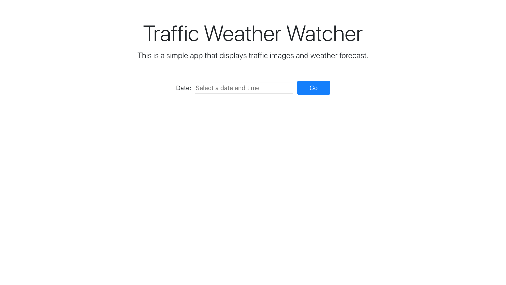
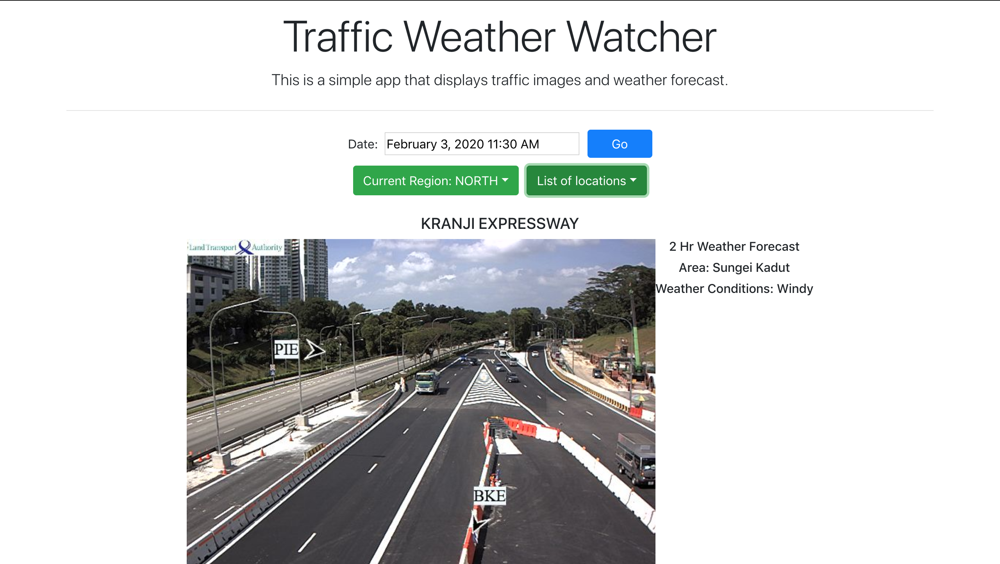

This project was bootstrapped with [Create React App](https://github.com/facebook/create-react-app).

# Traffic Weather Watcher App

**A `react` Web App built to fetch Singapore's past traffic cam images and weather forecasts.**

Demo: https://saimun.me/trafficweatherwatcher/





## Installation 
In the project directory, you can run: 

```
1. npm install
2. npm start
```


Runs the app in the development mode.<br />
Open [http://localhost:3000](http://localhost:3000) to view it in the browser.
